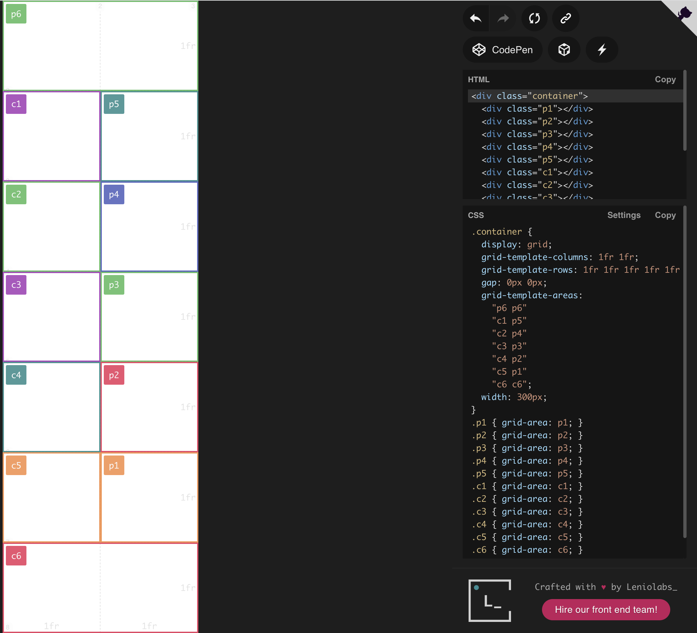

# Mancala

The mancala games are a family of two-player turn-based strategy board games played with small stones, beans, or seeds and rows of holes or pits in the earth, a board or other playing surface. The objective is usually to capture all or some set of the opponent's pieces.

Versions of the game date back to the 7th century and evidence suggests the game existed in Ancient Egypt. It is among the oldest known games to still be widely played today.

## Screenshot

## Technologies Used

- Javascript
- jQuery
- HTML
- CSS
- Layoutit

## Getting Started

[HOW TO PLAY CLICK HERE](https://harriscenter.org/wp-content/uploads/2020/03/mancala_rules.pdf)

# [CLICK HERE TO PLAY](https://mancalabyjohn.netlify.app/)

## Future Iterations

Add Pebble Images

Add peaceful music to the background.

Add indicators to show what holes the player can select.

Make it mobile responsive.

